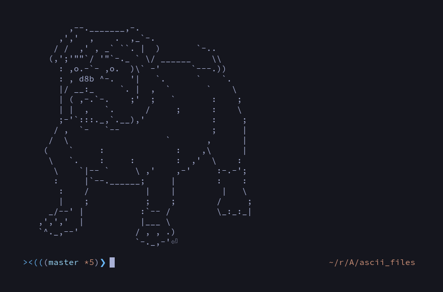

# Ascii Arts For Your Terminal!
### This repo contains a set of colored and non-colored Ascii Arts.

 

## Content Table
* [Alien](ascii_files/alien)
* [Among-Us](ascii_files/amongus)
* [Bird](ascii_files/bird)
* [C](ascii_files/c)
* [Dog](ascii_files/dog)
* [Godot](ascii_files/godot)
* [Horn](ascii_files/horn)
* [Poison](ascii_files/poison)
* [PukeSkull](ascii_files/pukeskull)
* [Python](ascii_files/python)

 

## [Alien](ascii_files/alien)

 

## [Among-Us](ascii_files/amongus)

 

## [Bird](ascii_files/bird)

 

## [C](ascii_files/c)

 

## [Dog](ascii_files/dog)

 

## [Godot](ascii_files/godot)

 

## [Horn](ascii_files/horn)

 

## [Poison](ascii_files/poison)

 

## [PukeSkull](ascii_files/pukeskull)

 

## [Python](ascii_files/python)

 

## Contribution
contributions to add new arts or edit art color are welcome.

 

## License

[MIT](LICENSE)
